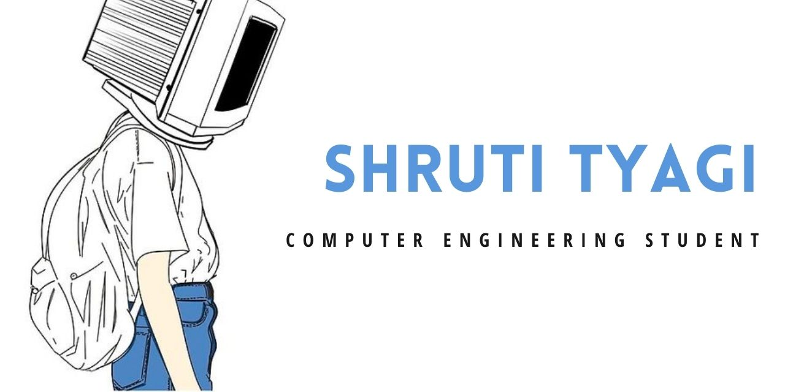

## Hey there 👋 

### About Me 🤟

- 👩‍💻 I am a Computer Engineering Sophomore from Mumbai, India
- 💙 I enjoy everything about technology and love learning and researching about any technology related topic ! 
- 🌱 I’m currently learning Data Science, Artifical Inteligence and Machine Learning
- 👯‍♀️ I'm looking to collaborate on any Open-source,Python,Data Science,Artifical Inteligence or Machine learning project
- 💬 Brainstorm with me over Tech, Data Science and Career
- 💫 Apart from Coding, I also enjoy traveling, learning new things online, social media marketing, event management, listening to music, watching movies and trying out new cuisines.
- 🤓 Have a look at my [Resume](https://drive.google.com/file/d/10xtgO4lHhVn1liVkwaXiNEgrzyhIRiEG/view?usp=sharing)

### Contact Me 📫
- E-Mail   : shruti.tyagi@somaiya.edu / tyagishruti4102@gmail.com
- Linkedin : [tyagishruti](https://www.linkedin.com/in/tyagishruti/)

<!--  -->

### Technologies 👩🏻‍💻

### Achievements and Experience ⭐

- Interned as a Software Developement Intern at Ernst & Young India
- Interned in the fields of Machine Learning and Web Developemnt at K.J. Somaiya College of Engineering
- I got selected as a Women Engineering Scholar'21 by Google & Talentsprint. I am one among the top 400 students selected out of the total 27,643 applicants.
- I recieved and completed the [AWS Machine Learning Foundations](https://confirm.udacity.com/RWTL9L3P) Nanodegree Scholarship from AWS and Udacity. 
- Completed online certifications under [30 Days of Google Cloud](https://certificate.givemycertificate.com/c/76077c25-3a95-4000-b519-6dbc10ff330a), Goldman Sachs, CISCO, and Univeristy of Michigan
- Currently a member of Computer Society of India -KJSCE
- Attended AWS Women in Tech Day and AnitaB.org Open-Source Day Summer 2021

